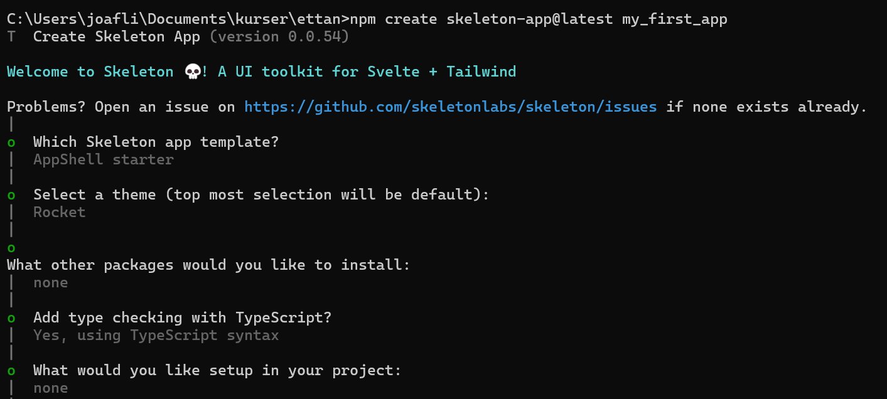
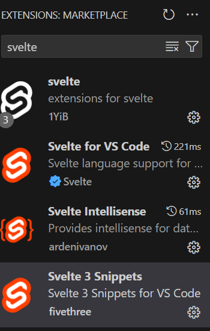
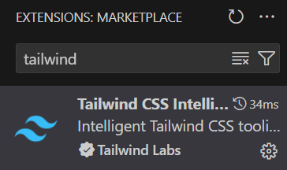
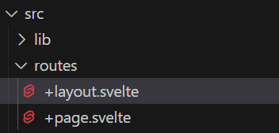

# How to get started with Svelte using Skeleton UI
A simple and practical tutorial for beginners

## Introduction
Svelte is a modern framework for building user interfaces with JavaScript. Unlike other frameworks, Svelte compiles your code to plain JavaScript, which means less code to ship, faster performance, and no virtual DOM overhead. Skeleton UI is a lightweight and responsive CSS framework that provides basic styles for typography, buttons, forms, tables, and grids. In this guide, you will learn how to set up a Svelte project with Skeleton UI and create a simple web app.

## Prerequisites
To follow this guide, you will need:
- A basic knowledge of HTML, CSS, and JavaScript
- A code editor of your choice
- Node.js and npm installed on your machine

## Step 1: Create a Svelte project
The easiest way to create a Svelte project is to use the official template from the Skeleton UI website. You can use the following command to create a new project in a folder called my-skeleton-app:

`npm create skeleton-app@latest my-skeleton-app ` 
 
Above is the choices i made, follow me or make your own.
This will clone the template repository and install the dependencies. You can then change into the project folder and start the development server:
```
cd my-skeleton-app
code ..
npm install
npm run dev
``` 
This will launch the server on http://localhost:5173/. You can open this URL in your browser and see the default Svelte app.


### Step 2: Getting started

Before you can create your web app, you need to install some extensions for your code editor to make it easier to work with Svelte. If you are using Visual Studio Code, you can install the following extensions:

- Svelte: This extension provides useful snippets for common Svelte features, such as components, props, events, transitions, and stores. You can install it from the VS Code Marketplace or by searching for "Svelte Snippets" in the Extensions tab.

- Svelte for VS Code: This extension provides syntax highlighting, formatting, linting, and intellisense for Svelte files. You can install it from the VS Code Marketplace or by searching for "Svelte" in the Extensions tab.

- Svelte IntelliSense: This extension provides useful snippets for common Svelte features, such as components, props, events, transitions, and stores. You can install it from the VS Code Marketplace or by searching for "Svelte Snippets" in the Extensions tab.

- Svelte Snippets: This extension provides useful snippets for common Svelte features, such as components, props, events, transitions, and stores. You can install it from the VS Code Marketplace or by searching for "Svelte Snippets" in the Extensions tab.

- Tailwind CSS IntelliSense: This extension provides help with writing styling using Tailwind, such as buttons, forms, grids, tables, and typography. You can install it from the VS Code Marketplace or by searching for "Tailwind" in the Extensions tab.
 
 
After installing these extensions, you can proceed to the next step of creating your web app.


   

### Step 1: Change the text skeleton to hello world
To change the text "skeleton" to "hello world", you need to edit the layout file in the `src` folder. The layout file is named `+layout.svelte` and it defines the common structure and style for all the pages in your web app. You can think of it as a template that wraps around the content of each page.

Replace the text "skeleton" with "hello world" in the layout file. Save the file and refresh your browser. You should see the text "hello world" instead of "skeleton" on the top left corner of your web app.


### Step 2: Explain the difference between layout file and page file

The layout file and the page file are both Svelte components, but they serve different purposes. 

The layout file defines the common layout and style for all the pages in your web app, such as the header, footer, sidebar, or navigation. 

The page file defines the specific content and logic for each page in your web app, such as the title, data, or events.

You can use the layout file to avoid repeating the same code and style for every page, and to ensure consistency and maintainability. 

You can use the page file to customize the content and functionality for each page, and to handle dynamic data and user interactions.

The layout file and the page file are linked by a special `<slot>` element in the layout file. The `<slot>` element acts as a placeholder for the content of the page file. When the web app renders a page, it inserts the content of the page file into the `<slot>` element of the layout file.

For example, if you have a page file named `+page.svelte` in the `src` folder, it will be rendered inside the `<slot>` element of the layout file, like this:
 

### Adding a Simple UI Element

#### 1. Editing the Page File

Navigate to the `src/routes` directory and open the `+page.svelte` file. Here, right after the text "Launch Documentation," add a warm greeting like `Hello, world of UI!` Save the file and observe this simple change reflecting live on your webpage. It's a small step, but it's thrilling to see your code come to life!

#### 2. Integrating Skeleton UI Button

Now, let's add a bit more flair with a Skeleton UI button. Head over to the [Skeleton UI documentation](https://skeleton-ui.com/docs) and find the Button component in the Tailwind section. Copy the button code snippet and paste it next to your greeting. To give our button a rounded appearance, we'll need to tweak its CSS. In your project's global CSS file, add `.button { @apply rounded-lg; }` to apply Tailwind's `rounded-lg` utility, giving our button those soft, rounded edges. The transformation from plain to stylish is just a CSS tweak away!

### Incorporating Complex UI Components

#### Utilizing Listboxes from Skeleton UI

For a more interactive component, let's introduce a Listbox into our project. Skeleton UI's Listboxes are perfect for enhancing user experience with selectable options. Navigate to the Listboxes section in the Skeleton UI documentation under the Svelte category. Copy the Listbox example code and paste it into your Svelte script section. To simplify, change the `value` part within the script to `let valueSingle = 'books';`. This will initialize our Listbox with a default value, making the component ready to use immediately. Remember, all script code should be wrapped with `<script>` tags to ensure proper functionality.

### Conclusion

Congratulations! You've just added a touch of elegance to your Svelte project with Skeleton UI components. From a simple greeting to a styled button and an interactive Listbox, you've taken significant steps towards creating more engaging and visually appealing web applications. Don't stop here; Skeleton UI has a treasure trove of components for you to explore and integrate into your projects. Experiment, learn, and most importantly, have fun coding!

### Additional Resources

To further your learning and exploration, here are some invaluable resources:
- [Svelte Documentation](https://svelte.dev/docs)
- [Skeleton UI Documentation](https://skeleton-ui.com/docs)
- [Tailwind CSS Guide](https://tailwindcss.com/docs)

Dive into these resources to discover more components and styling techniques that will elevate your web development skills to new heights. Happy coding!

---

### Creating Your First Svelte Component
In this part of the tutorial, we'll guide you through creating your first Svelte component, incorporating Tailwind CSS for styling and utilizing Skeleton UI for a polished, modern look. This guide assumes you've already set up a Svelte project with Tailwind CSS and Skeleton UI installed as per the previous sections.

#### Step 1: Setting Up Your Component

1. **Create a New Component File**
   - In your project's `src` directory, create a new file named `MyComponent.svelte`. This will be our custom component.

2. **Add Basic Markup**
   - Open `MyComponent.svelte` in your editor and add the following Svelte template code:
     ```html
     <script>
       // JavaScript code goes here
     </script>

     <div class="component-container">
       <!-- Component content will go here -->
     </div>

     <style>
       /* Tailwind CSS utilities and custom styles */
     </style>
     ```

#### Step 2: Styling With Tailwind CSS

1. **Apply Tailwind Utilities**
   - Within the `<style>` tag, we're going to leverage Tailwind's utility-first CSS to style our component. However, remember that Tailwind classes are generally applied directly in the markup. Here's an example of applying a background color, text color, and padding to our component's container:
     ```html
     <div class="component-container bg-blue-500 text-white p-4">
       <!-- Component content will go here -->
     </div>
     ```

#### Step 3: Incorporating Skeleton UI

1. **Add a Skeleton UI Element**
   - Let's enhance our component with a Skeleton UI element. Suppose we want to add a button; navigate to the Skeleton UI documentation and locate a button component you'd like to use.
   - Once you've found the button you like, copy its HTML code. Paste this code inside the `div.component-container` in your `MyComponent.svelte` file.
   - Remember, the Skeleton UI library leverages Tailwind CSS for styling, ensuring consistency across your UI.

#### Step 4: Utilizing Your Component

1. **Import and Use Your Component**
   - Open the file where you want to use your newly created component, such as `App.svelte`.
   - At the top of your `App.svelte` file, import `MyComponent` by adding the following line:
     ```javascript
     import MyComponent from '../MyComponent.svelte';
     ```
   - Now, use `MyComponent` within the app's markup:
     ```html
     <main>
       <MyComponent />
       <!-- Other content -->
     </main>
     ```

### Conclusion

And there you have it! You've successfully created your first Svelte component, styled it with Tailwind CSS, and incorporated an element from Skeleton UI. This process not only introduces you to the basics of Svelte component development but also demonstrates how to integrate external UI libraries and CSS frameworks for a more robust and visually appealing design.

Experiment with different Skeleton UI components and Tailwind utilities to further customize your component. The possibilities are endless, and the more you practice, the more proficient you'll become at creating dynamic, responsive web applications with Svelte.

### Additional Tips

- **Explore Tailwind CSS:** Dive deeper into Tailwind's documentation to discover more utilities that can help you design your components exactly how you envision them.
- **Customize Skeleton UI Components:** Don't be afraid to explore the Skeleton UI documentation for different components that could enhance your project. Each component is customizable with Tailwind, giving you full control over its appearance.
- **Component Interaction:** As you grow more comfortable with Svelte, experiment with props, events, and reactive statements to make your components interactive and data-driven.
Certainly! Let's expand on our tutorial by adding interactivity to our component. We'll start by making the button increment a counter each time it's clicked. After that, we'll transition to using a Svelte store for state management, allowing the counter's value to be shared across components.

By following this guide, you've taken a significant step in your journey as a Svelte developer. Keep building, keep experimenting, and most importantly, enjoy the process of creating with Svelte!

### Step 2: Adding Interactivity with a Counter
Let's expand on our journey by adding interactivity to our component. We'll start by making the button increment a counter each time it's clicked. After that, we'll transition to using a Svelte store for state management, allowing the counter's value to be shared across components.
#### Part 1: Local Counter State

1. **Modify Your Component for a Counter**
   - Open `MyComponent.svelte`.
   - First, let's add a script block (if not already present) at the top of your component file. Here, we will declare a variable to keep track of the counter state.
     ```javascript
     <script>
       let counter = 0;

       function incrementCounter() {
         counter += 1;
       }
     </script>
     ```
   - Modify the button within `MyComponent.svelte` to increment the counter on click. Assuming you have a button from the previous step, add an `on:click` event handler that calls `incrementCounter()` when the button is clicked.
     ```html
     <button class="bg-blue-500 text-white p-2 rounded" on:click="{incrementCounter}">
       Click me
     </button>
     ```
   - Display the counter value within your component. Below the button, add a paragraph tag to show the current counter value.
     ```html
     <p>Counter: {counter}</p>
     ```

#### Part 2: Global Counter State with Svelte Store

1. **Create a Store File**
   - In your project's `src` folder, create a new file named `store.js`. This file will hold our global state.
   - Inside `store.js`, import `writable` from `svelte/store` and create a new store for our counter.
     ```javascript
     import { writable } from 'svelte/store';

     export const counter = writable(0);
     ```

2. **Modify Your Component to Use the Store**
   - Go back to `MyComponent.svelte`.
   - At the top of your script block, import the `counter` store from `store.js`.
     ```javascript
     <script>
       import { counter } from './store.js';

       function incrementCounter() {
         counter.update(n => n + 1);
       }
     </script>
     ```
   - Update the counter display to use the store value. To do this, you'll need to subscribe to the counter store using the `$:` syntax.
     ```html
     <p>Counter: {$counter}</p>
     ```
   - Your button's `on:click` handler remains the same, as it calls `incrementCounter()` which now updates the store.

#### Conclusion

With these enhancements, your Svelte component now features an interactive button that increments a counter each time it's clicked. Initially, the counter's state is managed locally within the component. Later, we transition to a global state management approach using Svelte stores, allowing the counter's value to be accessible and mutable across different components.

This progression not only demonstrates the basics of adding interactivity to components but also introduces a scalable way to manage state in larger applications. Experiment further by creating additional components that interact with the global counter store, observing how Svelte efficiently updates the UI in response to state changes.

### Additional Challenges

- **Reset Button:** Add another button to reset the counter to zero.
- **Decrement Button:** Implement a button that decreases the counter, showcasing how to handle multiple actions affecting the same state.
- **Multiple Counters:** Try creating multiple counter components that share the same global state, illustrating the power of Svelte stores in synchronizing state across components.

By continuing to explore Svelte's reactivity and state management features, you'll gain deeper insights into building dynamic, interactive web applications.


### Creating a Pokémon API Component
In this part of the tutorial, we're going to create a new Svelte component that connects to the Pokémon API to fetch and display information about Pikachu. We'll display Pikachu's sprite (image), name, height, weight, and type, applying Tailwind CSS for styling to ensure a great user experience. This example will demonstrate how to fetch data from an external API within a Svelte component.

#### Step 1: Setting Up The Component

1. **Create a New Component File**
   - In your project's `src` directory, create a new file named `PokemonInfo.svelte`.

2. **Basic Structure**
   - Set up the initial structure of your component with placeholders for the data we'll fetch.
     ```html
     <script>
       // We will add our script here
     </script>

     <div class="pokemon-container p-4 max-w-sm rounded overflow-hidden shadow-lg">
       
       <div class="px-6 py-4">
         <div class="font-bold text-xl mb-2">Name: </div>
         <p class="text-gray-700 text-base">Height: </p>
         <p class="text-gray-700 text-base">Weight: </p>
         <div class="tags"></div>
       </div>
     </div>

     <style>
       /* Additional styling can go here */
     </style>
     ```

#### Step 2: Fetching Data from the Pokémon API

1. **Add Script to Fetch API Data**
   - Inside the `<script>` tag, write a function to fetch Pikachu's data from the Pokémon API and define reactive variables to store the fetched data.
     ```javascript
     <script>
       import { onMount } from 'svelte';

       let pokemon = {
         name: '',
         image: '',
         height: '',
         weight: '',
         types: []
       };

       onMount(async () => {
         const response = await fetch('https://pokeapi.co/api/v2/pokemon/pikachu');
         const data = await response.json();
         pokemon = {
           name: data.name,
           image: data.sprites.front_default,
           height: data.height,
           weight: data.weight,
           types: data.types.map((typeInfo) => typeInfo.type.name)
         };
       });
     </script>
     ```
   - This code uses Svelte's `onMount` lifecycle function to fetch Pikachu's data when the component mounts. It then populates the `pokemon` object with the fetched data.

#### Step 3: Displaying the Data

1. **Update the HTML to Display Pokémon Data**
   - Modify the component's HTML to display the fetched Pokémon data, using Tailwind CSS for styling.
     ```html
     
     <div class="px-6 py-4">
       <div class="font-bold text-xl mb-2">Name: {pokemon.name.toUpperCase()}</div>
       <p class="text-gray-700 text-base">Height: {pokemon.height} decimetres</p>
       <p class="text-gray-700 text-base">Weight: {pokemon.weight} kilograms</p>
       <div class="tags">
         {#each pokemon.types as type}
           <span class="inline-block bg-gray-200 rounded-full px-3 py-1 text-sm font-semibold text-gray-700 mr-2 mb-2">{type}</span>
         {/each}
       </div>
     </div>
     ```

#### Conclusion

By completing this component, you've learned how to fetch and display data from an external API in a Svelte application. We've applied Tailwind CSS to style our component, ensuring the data is presented in an aesthetically pleasing and user-friendly manner. 

This exercise demonstrates a key aspect of web development: fetching and displaying data from external sources. The Pokémon API is a fun and engaging API to work with, but the principles you've learned here can be applied to any API.

### Additional Challenges

- **Error Handling:** Implement error handling for the API request to manage and display errors gracefully.
- **Loading State:** Add a loading state to the component to inform the user that data is being fetched.
- **Expand Your Pokédex:** Allow the user to input the name of a Pokémon and display information for their chosen Pokémon, turning this into a more dynamic and interactive Pokédex.

This step is crucial in understanding how real-world applications interact with external data sources and manage state based on asynchronous data fetching. Experiment with these concepts, and don't hesitate to explore more complex APIs and data structures as you become more comfortable with Svelte and API integrations.


### Modifying the Pokémon Component
For this part of the tutorial, we will evolve our Pokémon component to accept a dynamic input for the Pokémon name. Then, we'll create a new Svelte page named `Pokedex.svelte` to display a grid of Pokémon cards. Lastly, we'll ensure navigation is possible from the main page to the Pokédex page by adding a button. This step introduces component props, dynamic data handling, and basic routing in a Svelte application.

1. **Accepting Props for Dynamic Pokémon Names**
   - Modify `PokemonInfo.svelte` to accept a prop for the Pokémon name.
     ```javascript
     <script>
       export let name = 'pikachu'; // Default to Pikachu if no name is provided
       import { onMount } from 'svelte';

       let pokemon = { ... };

       onMount(async () => {
         const response = await fetch(`https://pokeapi.co/api/v2/pokemon/${name}`);
         const data = await response.json();
         pokemon = { ... };
       });
     </script>
     ```

### Creating the Pokédex Page

1. **Setting Up the Pokédex Page**
   - Create a new folder named  `Pokedex`in your `src/routes` directory and a file named `+page.svelte`.
   - In `+page.svelte`, import `PokemonInfo.svelte` and set up a grid to display multiple Pokémon cards.
     ```html
     <script>
       import PokemonInfo from '../PokemonInfo.svelte';
     </script>

     <div class="grid grid-cols-2 md:grid-cols-3 lg:grid-cols-4 gap-4 p-4">
       {#each pokemonList as pokemon}
         <PokemonInfo name="{pokemon}" />
       {/each}
     </div>

     <style>
       /* Add any additional styling for your Pokédex page here */
     </style>
     ```

2. **Define a List of Pokémon Names**
   - Within the `<script>` tag in `Pokedex.svelte`, define an array of Pokémon names that will be used to display the cards.
     ```javascript
     let pokemonList = ['pikachu', 'bulbasaur', 'charmander', 'squirtle', 'eevee', 'jigglypuff', 'snorlax', 'psyduck', 'meowth', 'mewtwo'];
     ```

### Adding Navigation to the Pokédex Page

1. **Create a Navigation Button in Your Main Page**
   - In your main page (e.g., `App.svelte` or `index.svelte`), add a button that navigates to the Pokédex page.
   - If you're not using a router, you might need to add a simple click handler that changes the window location. However, for SvelteKit or Sapper, use the `link` action from `svelte-routing` or the `navigate` function from `@sveltejs/kit`.

   Here's an example for a basic non-router approach:
   ```html
   <script>
     function goToPokedex() {
       window.location.href = '/pokedex'; // Adjust the URL based on your project setup
     }
   </script>

   <button on:click={goToPokedex}>Go to Pokédex</button>
   ```

   For SvelteKit, it would be more in line with using `<a>` tags with `href` or using the `$app/navigation` module for programmatic navigation.

#### Conclusion

You've successfully modified the Pokémon component to dynamically display information based on props, created a grid layout in a new Pokédex page to showcase a list of Pokémon, and added navigation between your main page and the Pokédex. This tutorial introduced you to working with props, iterating over lists, and basic navigation in Svelte apps, all while building something visually appealing and interactive.

### Additional Challenges

- **Pagination or Infinite Scroll:** Implement pagination or an infinite scroll for your Pokédex to handle a larger number of Pokémon.
- **Details Page:** Create a detailed view for each Pokémon that users can navigate to by clicking on a Pokémon card.
- **Filtering and Sorting:** Add functionality to filter Pokémon by type or sort them by different criteria (e.g., name, height).

These enhancements will further deepen your understanding of Svelte and how to create more complex and user-friendly web applications.